## 1. Summary

The Agentic AI Factory is a multi-agent AI system for enterprise application transformation using AWS Bedrock AgentCore Runtime. This specification documents the foundational codebase structure across four architectural layers: Service Layer (4 specialized AI agents), Backend Layer (AppSync GraphQL API integration), Arbiter Layer (multi-agent orchestration), and Frontend Layer (React SPA). The system guides organizations through assessment, design, planning, and implementation specification generation for transforming traditional applications into agentic AI-powered solutions.

### 1.1 Problem Statement

Enterprise organizations need a systematic approach to transform traditional applications into agentic AI solutions. This requires specialized AI agents that can assess readiness across technical, business, governance, and commercial dimensions; generate high-level and detailed solution designs; create implementation roadmaps; and produce deployment-ready specifications. The system must orchestrate multiple agents, maintain conversation state across sessions, integrate with AWS services, and provide real-time user interfaces for multi-stakeholder collaboration.

### 1.2 Current Situation

The Agentic AI Factory is a fully implemented 4-layer architecture deployed on AWS:
- **Service Layer**: 4 Bedrock AgentCore agents (Assessment, Design, Planning, Implementation) with knowledge bases, document processing, and session management
- **Backend Layer**: AppSync GraphQL API, Cognito authentication, DynamoDB state management, EventBridge orchestration, Lambda resolvers
- **Arbiter Layer**: Supervisor-worker pattern with Fabricator agent for dynamic agent creation, SQS queues, and orchestration state management
- **Frontend Layer**: React 18 + TypeScript SPA with Vite, AWS Amplify integration, Radix UI components, deployed on S3/CloudFront
- **Infrastructure**: AWS CDK for IaC, GitLab CI/CD pipelines, multi-environment support (dev/staging/prod)

### 1.3 Visual Design

```mermaid
flowchart TD
  A[Agentic AI Factory] --> B[Service Layer]
  A --> C[Backend Layer]
  A --> D[Arbiter Layer]
  A --> E[Frontend Layer]
  
  B --> B1[Agent 1: Assessment]
  B --> B2[Agent 2: Design]
  B --> B3[Agent 3: Planning]
  B --> B4[Agent 4: Implementation]
  B --> B5[Knowledge Bases]
  B --> B6[Document Processing]
  
  C --> C1[AppSync GraphQL API]
  C --> C2[Cognito Auth]
  C --> C3[Lambda Resolvers]
  C --> C4[EventBridge]
  C --> C5[DynamoDB Tables]
  C --> C6[S3 Storage]
  
  D --> D1[Supervisor Agent]
  D --> D2[Fabricator Agent]
  D --> D3[Worker Agents]
  D --> D4[SQS Queues]
  D --> D5[Orchestration State]
  
  E --> E1[React 18 + TypeScript]
  E --> E2[Vite Build System]
  E --> E3[AWS Amplify]
  E --> E4[Radix UI Components]
  E --> E5[CloudFront CDN]
  
  B1 --> KB1[Assessment KB]
  B2 --> KB2[AWS Patterns KB]
  B3 --> KB3[Implementation KB]
  B4 --> KB4[Kiro Specs KB]
```

## 2. Requirements

### 2.1 User Stories/Use Cases

- As an enterprise user, I want to upload documents and participate in conversational assessment so the system can evaluate my organization's AI readiness
- As a platform operator, I want to deploy specialized AI agents to Bedrock AgentCore Runtime so the multi-agent system is available with auto-scaling
- As a user, I want real-time progress updates for assessment and design phases so I understand workflow status without refreshing
- As a developer, I want GraphQL API with real-time subscriptions so I can query data and receive live updates
- As an administrator, I want to manage users and roles so I can control access and permissions across the platform
- As the system, I want to orchestrate multi-agent tasks so complex workflows can be coordinated across multiple agents
- As a platform operator, I want automated CI/CD deployment so changes are validated and deployed consistently

### 2.2 Functional Requirements

**Service Layer (4 AI Agents on Bedrock AgentCore Runtime)**:

Agent 1 - Assessment Agent:
- Multi-format document ingestion (PDF, Word, JSON, YAML) with Bedrock Data Automation
- Entity and relationship extraction with confidence scoring
- Gap identification and adaptive questioning engine
- Conversational assessment across technical, GRC, business, and economics dimensions
- Session state management in DynamoDB with S3 document storage
- Knowledge base integration for assessment guidelines

Agent 2 - Design Agent:
- Multi-dimensional assessment scoring (Technical 30%, GRC 25%, Business 25%, Economics 20%)
- High-level design document generation with 30 structured sections
- AWS patterns retrieval via MCP Server integration
- Markdown and PDF output generation using pandoc
- Progress tracking with section-level completion updates

Agent 3 - Planning Agent:
- Phased timeline development with dependencies and milestones
- Detailed architecture specification with AWS service recommendations
- Resource allocation planning (skills, roles, budget)
- Risk mitigation strategy development with probability and impact analysis
- KPI framework establishment for success measurement

Agent 4 - Implementation Agent:
- Three-path output generation:
  - Path A: Traditional dev specs (epics, stories, acceptance criteria)
  - Path B: AI-assisted development specifications with structured prompts
  - Path C: Kiro agent fabrication specifications with workflow orchestration
- Traceability mapping to assessment findings
- Deployment-ready specification generation

**Backend Layer (AppSync GraphQL API + AWS Services)**:

GraphQL API Infrastructure:
- AppSync API with Cognito User Pool authentication
- Real-time WebSocket subscriptions for live updates
- Queries for projects, agent status, conversations, user management
- Mutations for creating projects, sending messages, uploading documents
- X-Ray tracing and CloudWatch logging with field-level detail

Authentication & Authorization:
- Cognito User Pool with email verification and password policies
- Four user groups (admin, project_manager, architect, developer) with RBAC
- JWT tokens with 1-hour validity and 30-day refresh tokens
- Field-level authorization based on user roles and project ownership

State Management:
- DynamoDB tables for projects, conversations, agent status, orchestration state
- EventBridge event bus for agent coordination and workflow orchestration
- S3 buckets for document storage and session artifacts
- Lambda resolvers for GraphQL field resolution

**Arbiter Layer (Multi-Agent Orchestration)**:

Supervisor Agent:
- Task interpretation and execution plan creation
- Bedrock Converse API integration with Claude Sonnet 3.5 v2
- Multi-agent coordination with tool choice auto mode
- Orchestration state management in DynamoDB
- Parallel task coordination and result aggregation

Fabricator Agent:
- Dynamic agent creation based on task requirements
- Python code generation using Strands Agents SDK
- S3 code storage and DynamoDB configuration persistence
- Tool ecosystem management (Strands built-in + custom tools)
- EventBridge completion event publishing

Worker Agents:
- Dynamic code loading from S3 to Lambda /tmp/ directory
- Isolated execution environments with proper IAM roles
- Task completion event publishing to EventBridge
- Error handling with detailed logging to CloudWatch

**Frontend Layer (React SPA on S3/CloudFront)**:

Application Infrastructure:
- React 18 + TypeScript with Vite build system
- AWS Amplify for Cognito and AppSync integration
- Radix UI component library with Tailwind CSS
- Hot module replacement for fast development
- Optimized production builds with code splitting

User Interface:
- Authentication screens (sign up, sign in, email verification)
- Project management (create, view, update, delete projects)
- Real-time conversation interface with agent messaging
- Document upload with pre-signed S3 URLs
- Progress tracking with subscription-based updates
- Agent configuration management interface
- Tool configuration management interface
- User management and role assignment (admin only)

**Development Tooling**:

Build Systems:
- TypeScript compilation with path aliases
- esbuild for Lambda function bundling
- Vite for frontend development and production builds
- AWS CDK for infrastructure as code

Testing & Quality:
- Jest for unit and integration testing
- TypeScript type checking across all layers
- ESLint and Prettier for code quality
- Pre-commit hooks with husky and lint-staged

CI/CD Pipeline:
- GitLab CI/CD with automated testing
- Multi-environment deployment (dev, staging, prod)
- Manual approval gates for production
- CloudFormation stack deployment with CDK

**Documentation Standards**:

Layer-Specific Documentation:
- Service Layer: Agent specifications, tool documentation, knowledge base schemas
- Backend Layer: GraphQL schema, Lambda resolver documentation, DynamoDB table schemas
- Arbiter Layer: Orchestration patterns, fabrication guidelines, worker agent templates
- Frontend Layer: Component library, service layer documentation, integration guides

Project Documentation:
- README.md: Project overview and quick start
- DEPLOYMENT.md: Complete deployment guide with troubleshooting
- QUICK_START.md: 5-minute setup guide
- Layer-specific READMEs in each directory

**Security & Compliance**:

Data Protection:
- KMS encryption for DynamoDB and S3
- TLS 1.2+ for all communications
- Least-privilege IAM roles with resource-level permissions
- Session isolation by session ID and project ID

Authentication & Access Control:
- Cognito password policies (8+ chars, mixed case, numbers, symbols)
- MFA support (optional)
- JWT token validation on all GraphQL operations
- Role-based access control with four user groups

Audit & Monitoring:
- CloudWatch Logs for all Lambda functions and API operations
- X-Ray tracing for distributed request tracking
- CloudTrail logging for API calls

**Scalability & Performance**:

Auto-Scaling:
- AgentCore Runtime auto-scaling for agent instances
- Lambda automatic scaling based on invocation rate
- DynamoDB on-demand billing mode for automatic capacity scaling
- S3 automatic scaling for object operations
- CloudFront CDN for global content delivery

Performance Optimization:
- GraphQL response caching
- React component memoization
- Lazy loading and code splitting
- Conversation sliding window management (20 messages)
- Document processing with asynchronous Bedrock Data Automation